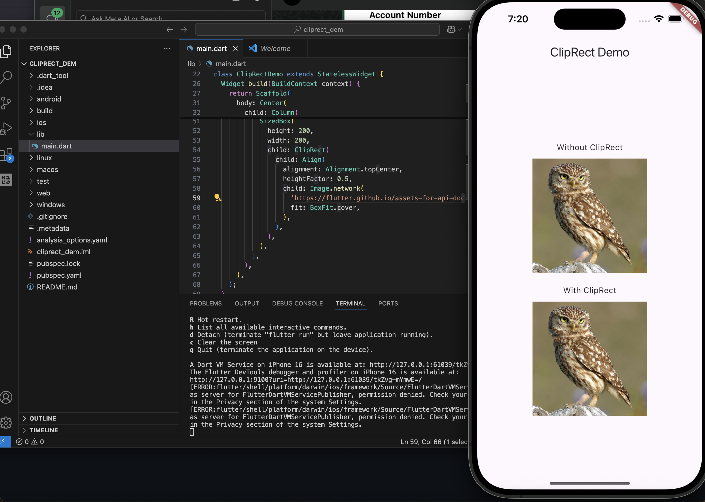
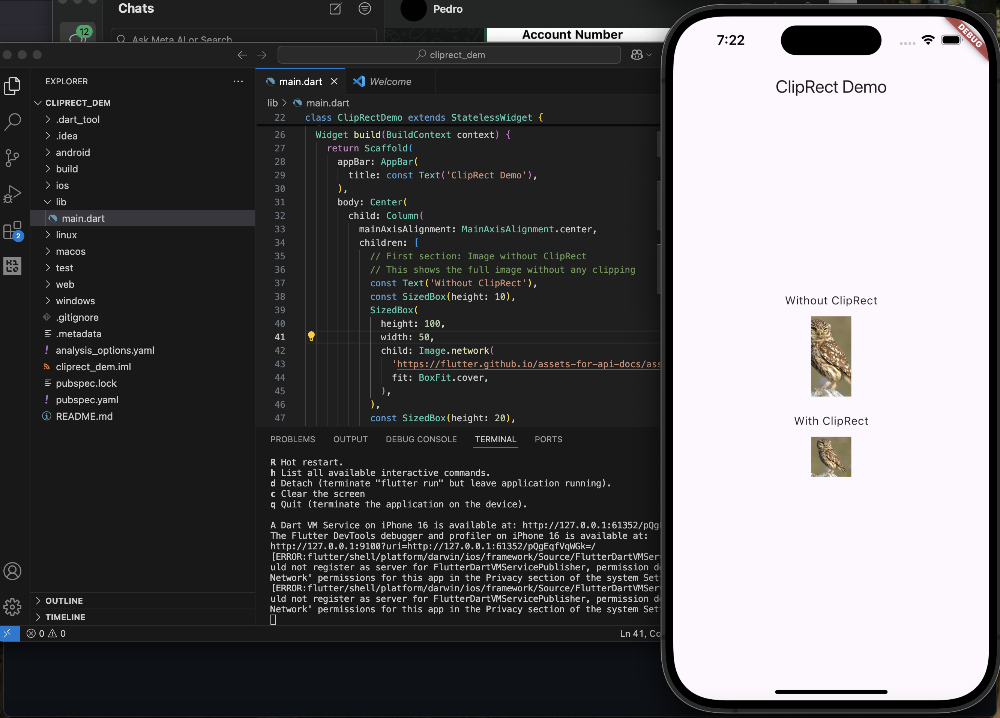

# ClipRect Demo

A Flutter project demonstrating the difference between using `ClipRect` widget and not using it for image clipping.

## Overview

This demo showcases how the `ClipRect` widget in Flutter can be used to clip child widgets to a rectangular boundary. The app displays two identical images side by side - one without clipping and one with `ClipRect` applied.

## What is ClipRect?

`ClipRect` is a Flutter widget that clips its child to a rectangular shape. It's particularly useful when you want to ensure that child widgets don't overflow their designated boundaries.

## Demo Screenshots

The app displays both scenarios on a single screen:

**First Screenshot - Initial State:**

**Second Screenshot - Comparison View:**

### Top Section - "Without ClipRect"
- Container size: 50 width × 100 height
- The owl image extends beyond the container boundaries
- Full image content is visible despite the small container size

### Bottom Section - "With ClipRect" 
- Same container size: 50 width × 100 height
- The owl image is properly clipped to fit within the container boundaries
- Only the portion within the 50×100 rectangle is visible

## Key Differences Demonstrated

| Without ClipRect | With ClipRect |
|------------------|---------------|
| Image overflows the container | Image is clipped to container size |
| Full image content visible | Only the portion within bounds is visible |
| No boundary enforcement | Strict boundary enforcement |

## Three Key Properties of `ClipRect` Demonstrated

 Here are three attributes relevant to how `ClipRect` works in this app:

1. **child**  
   - The widget to clip (in this case, an `Align` widget containing an image).  
   - Without this, `ClipRect` has no effect.
   
2. **clipBehavior** *(not explicitly used, defaults to `Clip.hardEdge`)*  
   - This controls how Flutter clips the child — options include `Clip.hardEdge`, `Clip.antiAlias`, etc.  
   - Can be adjusted for smoother visuals or better performance.

## Code Structure

The app consists of:
- `MyApp`: Main application widget
- `ClipRectDemo`: Stateless widget containing the demo layout

### Key Components

Both sections use the same reduced dimensions to clearly show the difference:

1. **Top Section - Image without ClipRect**: 
   - Container: 50 width × 100 height pixels
   - Image: Full owl image with `BoxFit.cover`
   - Result: Image extends beyond the small container boundaries

2. **Bottom Section - Image with ClipRect**:
   - Container: 50 width × 100 height pixels (same as top)
   - Image: Same owl image wrapped in `ClipRect` with `Align` widget
   - `heightFactor: 0.5` - Shows only the top half of the image
   - `alignment: Alignment.topCenter` - Aligns to top center
   - Result: Image is properly clipped to the small container boundaries

## How to Run

1. Ensure you have Flutter installed
2. Clone this repository
3. Run `flutter pub get` to install dependencies
4. Run `flutter run` to start the app

## Key Learning Points

- **ClipRect** prevents child widgets from overflowing their parent containers
- **Align widget** with `heightFactor` can be used to show specific portions of a child
- **BoxFit.cover** scales the image to cover the entire container while maintaining aspect ratio
- Visual boundaries are enforced only when clipping widgets are used

## Use Cases for ClipRect

- Preventing image overflow in fixed-size containers
- Creating custom shaped content areas
- Implementing smooth animations with boundary constraints
- Building responsive layouts that maintain visual consistency

## Flutter Resources

- [Lab: Write your first Flutter app](https://docs.flutter.dev/get-started/codelab)
- [Cookbook: Useful Flutter samples](https://docs.flutter.dev/cookbook)
- [ClipRect Widget Documentation](https://api.flutter.dev/flutter/widgets/ClipRect-class.html)

For help getting started with Flutter development, view the [online documentation](https://docs.flutter.dev/), which offers tutorials, samples, guidance on mobile development, and a full API reference.